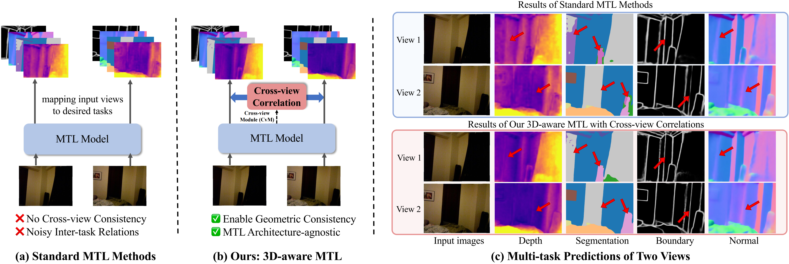
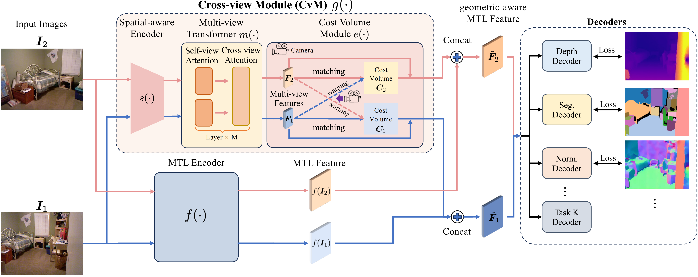

<div align="center">
<h2 align="center">&nbsp; 3D-Aware Multi-Task Learning with Cross-View Correlations for<br>Dense Scene Understanding
</h2>

[Xiaoye Wang](https://adamwang0224.github.io/), [Chen Tang](https://www.chentang.cc/), [Xiangyu Yue](https://xyue.io/), [Wei-Hong Li](https://weihonglee.github.io/)

<a href="https://arxiv.org/abs/2511.20646"></a>
</div>

<p align="center">
  
    <em>From left to right: RGB input and predictions of depth, segmentation, edge, and normal.</em>
</p>


## Updates
* Nov 2025: Paper released on arXiv. Code is coming soon.

## Overview
<div>
<p align="center";>
  
  <!-- <em>Comparison between standard MTL and our 3D-aware MTL framework.</em> -->
</p>
<p align="justify">
  Current approaches in multi-task learning (MTL) mainly capture cross-task relations in the 2D image space, often leading to unstructured features lacking 3D-awareness and inconsistent predictions across views (See (a) and (c) top). We argue that 3D-awareness is vital for modeling cross-task correlations, and propose to address this problem by integrating correlations across views as geometric consistency in the MTL network (See (b) and (c) bottom). 
</p>
</div>

<div>
<p align="center">
  
    <!-- <em>Illustration of our method for integrating cross-view correlation for enabling 3D-aware MTL.</em> -->
</p>
<p align="justify">
  As shown in above figure, given an image, we feed it and its neighbour view into the MTL encoder and extract the MTL features. In parallel, our lightweight cross-view module (CvM) takes as input both views. In CvM, a spatial-aware encoder encodes geometric-biased features, followed by a multi-view transformer that enables information exchanged across views and outputs cross-view features. A cost volume module then converts the cross-view features to the cost volume by warping the feature from one view to another given their relative camera parameters and matching features across views. Finally, both cost volume and cross-view feature are concatenated with the MTL features, forming the geometric-aware MTL feature for estimating predictions of multiple dense vision tasks. This module is architecture-agnostic and can be applied to both single and multi-view data. The overall framework is illustrated in the above figure. We show that this module is architecture-agnostic and can be applied to both single and multi-view data. Extensive results on NYUv2 and PASCAL-Context demonstrate that our method effectively injects geometric consistency into existing MTL methods to improve performance. 
</p>
</div>


## Contact
For any question, you can contact [Wei-Hong Li](https://weihonglee.github.io) or [Xiaoye Wang](https://adamwang0224.github.io/).

## Acknowledgements
We would like to thanks authors of [DepthSplat](https://github.com/cvg/depthsplat), [MVSplat](https://github.com/donydchen/mvsplat), [UniMatch](https://github.com/autonomousvision/unimatch), [SAK](https://github.com/innovator-zero/SAK) for their source code.


## Cite
```bibtex
@article{wang3dawaremtl,
      title={3D-Aware Multi-Task Learning with Cross-View Correlations for Dense Scene Understanding},
      author={Xiaoye Wang and Chen Tang and Xiangyu Yue and Wei-Hong Li},
      year={2025},
      eprint={2511.20646},
      archivePrefix={arXiv},
      url={https://arxiv.org/abs/2511.20646},
}
```